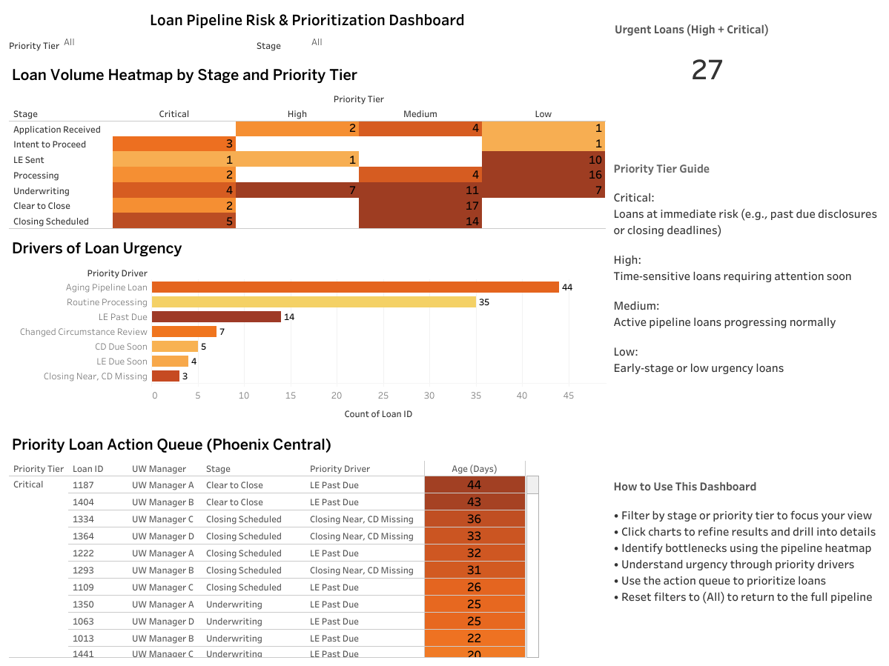

# Mortgage Loan Pipeline Risk & Prioritization Dashboard

## Live Dashboard
Tableau Public: https://public.tableau.com/views/MortgageLoanPipelineRiskPrioritizationDashboard/Dashboard1

---

## Overview
This project provides an operational view of a mortgage loan pipeline, designed to help underwriting teams identify risk, prioritize work, and manage loan flow across stages.

---

## Business Objective
Provide a clear, actionable view of pipeline risk and prioritization to support underwriting decision-making and workflow management.

---

## Key Insights
- Aging Pipeline Loans represent the largest share of workload across the pipeline  
- LE Past Due loans, while smaller in volume, represent the highest operational risk  
- Urgency is driven more by compliance timing (disclosures) than total loan volume  
- Bottlenecks can be identified by concentration of loans within specific stages  

---

## Dashboard Features
- Pipeline heatmap by stage and priority tier  
- Identification of urgency drivers (e.g., past due disclosures, aging loans)  
- Actionable loan-level queue for prioritization  
- KPI tracking urgent loans (High + Critical)  

---

## Tools Used
- SQL (MySQL)  
- Tableau Public  
